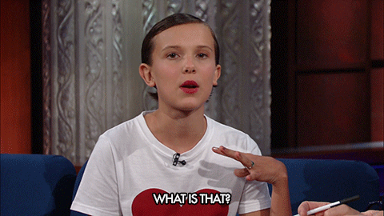
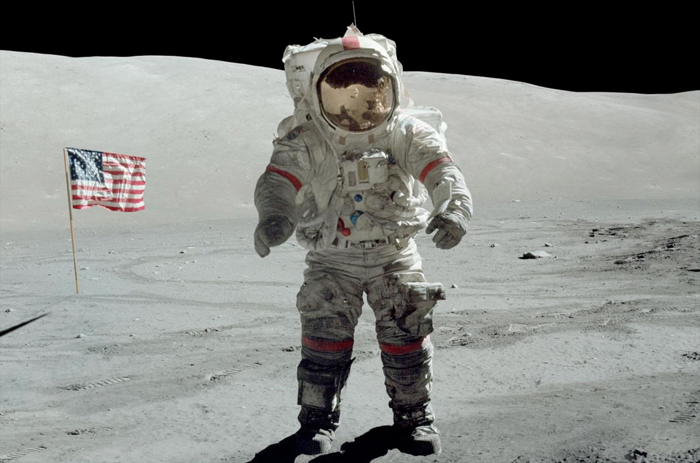
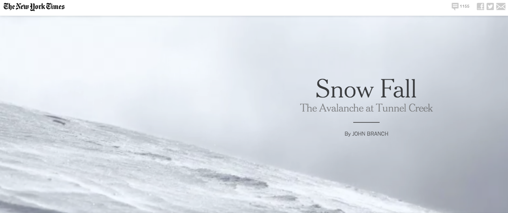
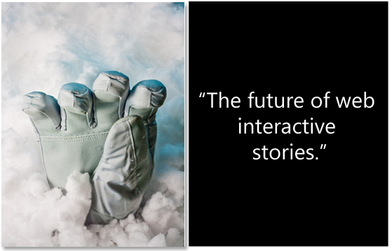
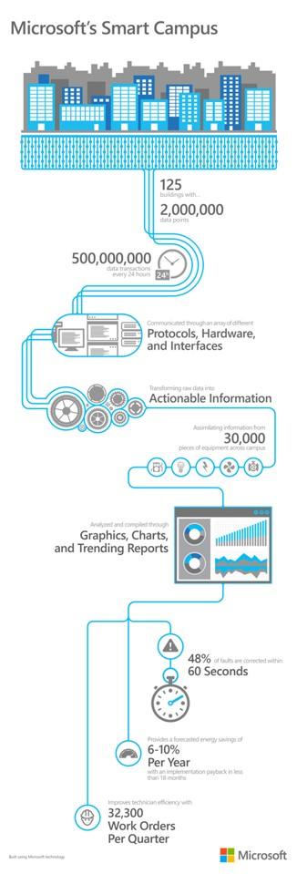
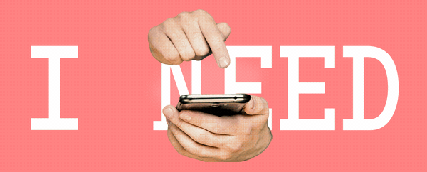
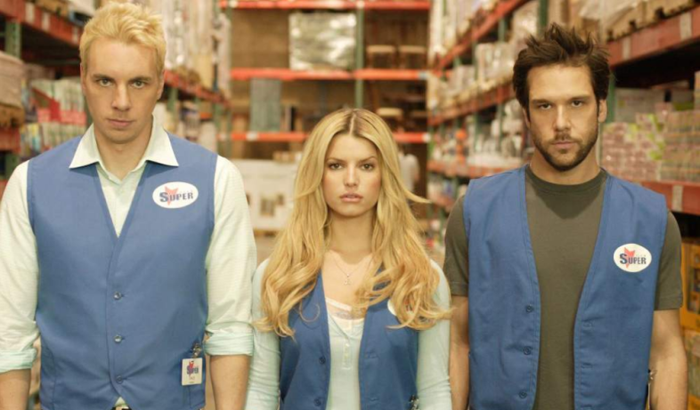

% THIS IS A PRESENTATION
% gavvy and jamiemramos
% Decemeber 5, 2016

<aside class="notes">
THIS IS A NOTE.
<\aside>

# 
<aside class="notes">
THIS IS A NOTE.
<\aside>

# 
<aside class="notes">
THIS IS A NOTE.
<\aside>

# 
<aside class="notes">
THIS IS A NOTE.
<\aside>

# 
<aside class="notes">
THIS IS A NOTE.
<\aside>

# 
<aside class="notes">
THIS IS A NOTE.
<\aside>

# A story is a narrative designed to interest, amuse or instruct the reader.
<aside class="notes">
THIS IS A NOTE.
<\aside

# 
<aside class="notes">
THIS IS A NOTE.
<\aside>

# 
<aside class="notes">
THIS IS A NOTE.
<\aside>

# Tell engaging stories
<aside class="notes">
THIS IS A NOTE.
<\aside

# 
<aside class="notes">
THIS IS A NOTE.
<\aside>

# 
<aside class="notes">
THIS IS A NOTE.
<\aside>

# 
<aside class="notes">
THIS IS A NOTE.
<\aside>

# 
<aside class="notes">
THIS IS A NOTE.
<\aside>

# 
<aside class="notes">
THIS IS A NOTE.
<\aside>

# 
<aside class="notes">
THIS IS A NOTE.
<\aside>

# 
<aside class="notes">
THIS IS A NOTE.
<\aside>

# 
<aside class="notes">
THIS IS A NOTE.
<\aside>

# 
<aside class="notes">
THIS IS A NOTE.
<\aside>

# 
<aside class="notes">
THIS IS A NOTE.
<\aside>

# 
<aside class="notes">
THIS IS A NOTE.
<\aside>

# 
<aside class="notes">
THIS IS A NOTE.
<\aside>

# 
<aside class="notes">
THIS IS A NOTE.
<\aside>

# 
“World’s greatest business storyteller” -Forbes
<aside class="notes">
THIS IS A NOTE.
<\aside>

// #  <object width="425" height="344"><param name="movie" value="http://swf.tubechop.com/tubechop.swf?vurl=lSiQA6KKyJo&start=200&end=263&cid=8630364"></param><embed src="http://swf.tubechop.com/tubechop.swf?vurl=lSiQA6KKyJo&start=200&end=263&cid=8630364" type="application/x-shockwave-flash" allowfullscreen="true" width="425" height="344"></embed></object>

# 
<aside class="notes">
THIS IS A NOTE.
<\aside>

# 
<aside class="notes">
THIS IS A NOTE.
<\aside>

# 
<aside class="notes">
THIS IS A NOTE.
<\aside>

# 
<aside class="notes">
THIS IS A NOTE.
<\aside>

# 
<aside class="notes">
THIS IS A NOTE.
<\aside>

# 
<aside class="notes">
THIS IS A NOTE.
<\aside>

# 
<aside class="notes">
THIS IS A NOTE.
<\aside>

# 
<aside class="notes">
THIS IS A NOTE.
<\aside>

# 
<aside class="notes">
THIS IS A NOTE.
<\aside>

